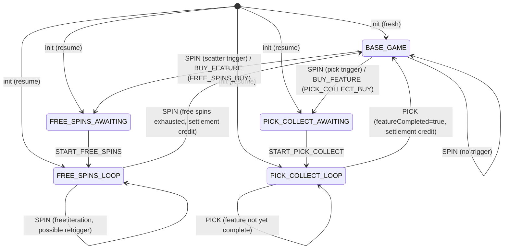
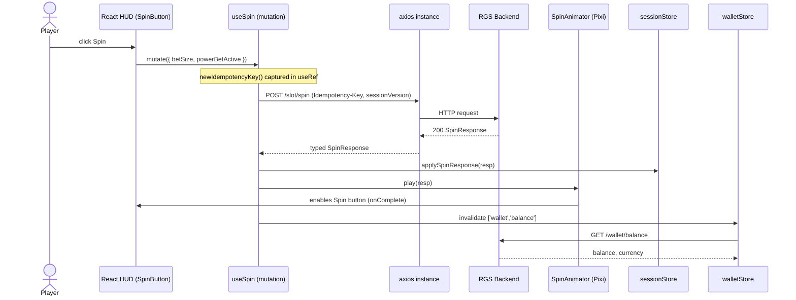

# AI Code Generation Blueprint: Velocity RGS Slot Client (React + PixiJS)

> **Read this document top-to-bottom before writing any code.** It is the single source of truth for the client. When in doubt, defer to the backend contract in [server/be-requirements.md](../server/be-requirements.md). When the two documents disagree, the **backend wins** and the discrepancy is logged in [`client/openapi/gap-report.md`](#hard-rule--do-not-invent).

---

## 0. Quick Reference for the AI Agent

This section is a digest of the absolute non-negotiables. Skim it first; the rest of the document is the detailed contract.

| # | Rule | Failure Mode if Ignored |
|---|---|---|
| Q1 | **Never compute a game outcome on the client.** No payline evaluation, no RNG, no balance arithmetic. | Regulatory failure; mismatched HUD vs. server. |
| Q2 | **Every mutating call sends `Idempotency-Key` (UUID v4) in the HTTP header — never in the body.** Same key on transport retry. New key on new user click. | Double-debits, `IDEMPOTENCY_KEY_CONFLICT` (409). |
| Q3 | **Every mutating call sends the latest `sessionVersion` from the last server response.** Never increment locally. | `SESSION_VERSION_CONFLICT` (409). |
| Q4 | **`availableActions` from the server is the ONLY source of truth for which buttons are enabled.** Never gate UI by client-derived state. | Players see actions the server will reject. |
| Q5 | **Money uses `decimal.js-light`, never `Number`.** `HALF_UP` rounding, scale 2 for display. | Floating-point drift, audit failures. |
| Q6 | **JWT lives in memory (or `sessionStorage` only in demo).** Never `localStorage`. Never bundled. | Token theft via XSS. |
| Q7 | **Pixi canvas is dumb.** It renders `matrix`, `stopPositions`, `winLines`, `activeFeatureView` from the server. It never decides anything. | Animation diverges from server outcome. |
| Q8 | **HTML in `.tsx`, CSS in colocated `.module.css`.** No inline `style={{...}}` for static styling. No `dangerouslySetInnerHTML`. | Repo-wide lint rule violation. |
| Q9 | **Enums mirror the backend verbatim** — no inventing values (no `AUTO_SPIN`, no `BUY_PICK` aliases, etc.). | Type drift; backend rejects with 400. |
| Q10 | **On `/init` boot, reconstruct UI from the response.** Do not assume `BASE_GAME`. Resume in-progress features from `activeFeatureView`. | Player loses an in-progress feature on reload. |

If a tool, library, or pattern is not explicitly listed in [Section 4](#4-technical-stack-requirements), it is **not in scope**. Adding one is a contract change, not an implementation detail.

---

## 1. Role & Context

You are an expert Frontend Engineer and Game Client Architect specializing in real-money iGaming clients that talk to a strict, deterministic Remote Gaming Server (RGS).

Your objective is to build the **Velocity RGS Slot Client**: a single-page web application that renders the `aztec-fire` 3×5 slot game and all its features (Free Spins, Power Bet, Bonus Buy, Pick & Collect) by talking exclusively to the backend defined in [server/be-requirements.md](../server/be-requirements.md).

The client is a **thin presentation tier**:

* It never computes wins.
* It never decides session transitions.
* It never generates random numbers.
* It never derives a balance from the bet and win — it always reads `balanceAfter` from the wallet response.

Every spin, pick, and feature entry is decided server-side. The client renders the authoritative response and animates the player-visible artifacts.

Target stack: **React 18+**, **TypeScript (strict)**, **PixiJS v8** for the slot canvas, **Vite** for tooling.

---

## 2. Architectural Principles & Strict Constraints

1. **Server is the Single Source of Truth.** The client must NEVER simulate spin outcomes, evaluate paylines, decide feature triggers, or mutate balance locally. The only fields the client may compute are visual derivatives (tween durations, particle counts, easing curves). Every monetary or state-bearing value rendered on screen is read verbatim from the backend response.
2. **FSM Mirror, Not FSM Owner.** The client maintains a *read-only mirror* of the backend `GameState` (`BASE_GAME`, `FREE_SPINS_AWAITING`, `FREE_SPINS_LOOP`, `PICK_COLLECT_AWAITING`, `PICK_COLLECT_LOOP`). Available actions on screen MUST be driven exclusively by the `availableActions` array returned by the server. Any locally-cached state that disagrees with the server response on the next round MUST be discarded — server wins.
3. **Strict Session Versioning.** Every mutating request MUST carry the latest `sessionVersion` received from the server. After every success the client replaces the cached `sessionVersion` with the new one. On `SESSION_VERSION_CONFLICT` (409) the client MUST re-`init` to recover, never patch the version locally.
4. **Idempotency on Every Mutation.** Every call to `/api/v1/slot/spin`, `/feature/start`, `/feature/buy`, `/feature/pick` and every `/api/v1/wallet/{debit,credit,rollback}` MUST be sent with a freshly generated `Idempotency-Key` header (RFC 4122 v4 UUID). The same key MUST be retried verbatim on transport failure until a definitive HTTP response is received. The key is NEVER sent in the body.
5. **Correlation by Default.** Every outgoing HTTP request carries an `X-Trace-Id` header (UUID v4). The same trace id is mirrored into the browser console log line for that interaction and surfaced in the in-app error toast for support.
6. **Pixi Canvas is Stateless About Game Logic.** Pixi scenes consume *render commands* derived from server responses (`matrix`, `stopPositions`, `winLines`, `featuresTriggered`, `activeFeatureView`). They emit *intent events* (`userClickedSpin`, `userClickedPick(position)`) but never decide the outcome.
7. **No Secrets in the Bundle.** The frontend never embeds the JWT signing secret, wallet credentials, or any server-only config. JWTs are obtained at runtime via the demo-only `/api/v1/dev/token` endpoint (during M2 demo flow) or, in production-shaped builds, injected by the operator iframe shell.
8. **Resumability.** On page reload, the client MUST call `/api/v1/slot/init` first and reconstruct the entire UI from the response (including a live in-progress Pick & Collect feature surfaced via `activeFeatureView`). The client MUST NOT assume `BASE_GAME` on boot.
9. **Reveal Discipline.** The client must NEVER request, render, or speculate the contents of unrevealed Pick & Collect tiles. The only authoritative source for revealed tiles is `activeFeatureView` plus the immediate `/feature/pick` response.
10. **HTML + CSS in Their Own Files.** React components own JSX only. CSS lives in colocated `.module.css` files (CSS Modules) — never inline `style={{...}}` blocks for non-dynamic styling, never `dangerouslySetInnerHTML` for HTML strings. Dynamic styles that need a runtime variable (e.g. a reel offset) use CSS custom properties (`style={{ '--reel-offset': px }}`).
11. **Pixi and React Coexist, They Do Not Fight.** The Pixi `Application` mounts into a single `<canvas>` host managed by one React effect; React owns the HUD overlay (balance, buttons, modals, toasts), Pixi owns the reels, win animations, and the Pick & Collect board art.
12. **One Mutation in Flight per Player.** The client serializes mutating calls (`spin`, `feature/*`). A second click while one is in flight is a no-op (the button is already disabled). This mirrors the server-side per-player action lock (`rgs:lock:player:{playerId}`, see backend A.10).
13. **No Optimistic Updates for Money or State.** UI reflects only what the server has confirmed. A spinner / "Still working…" caption fills the latency gap; the balance pill does NOT pre-debit.
14. **Deterministic Animations.** Spin animations are deterministic given a `SpinResponse` — no `Math.random()` in animator code. Two replays of the same response produce identical visuals (this enables Playwright snapshots).

---

## 3. State Machine Mirror

The client mirrors the backend FSM (backend A.7 / Section 1 / Section 4 of `be-requirements.md`). The diagram below is the authoritative client view. **Every edge corresponds to a server response that the client must accept and render — the client never authors a transition.**



### 3.1 Action Availability Matrix (Client Reference)

This matrix is **descriptive, not prescriptive** — the client honors `availableActions` from the server in all cases. Use it to validate fixtures and to write store transition tests.

| Current State | Expected `availableActions` | Bet Selector | Power Bet Toggle | Bonus Buy Panel |
|---|---|---|---|---|
| `BASE_GAME` | `["SPIN", "BUY_FEATURE"]` (if `bonusBuyEnabled`) else `["SPIN"]` | enabled | enabled (if `powerBetEnabled`) | enabled (if `bonusBuyEnabled`) |
| `FREE_SPINS_AWAITING` | `["START_FREE_SPINS"]` | disabled (locked bet) | disabled | disabled |
| `FREE_SPINS_LOOP` | `["SPIN"]` | disabled (locked bet) | disabled (unless `powerBetPersists=true`) | disabled |
| `PICK_COLLECT_AWAITING` | `["START_PICK_COLLECT"]` | disabled | disabled | disabled |
| `PICK_COLLECT_LOOP` | `["PICK"]` | disabled | disabled | disabled |

If the server returns an `availableActions` value that contradicts this matrix, **trust the server**. Log a warning at `WARN` level for the dev team to investigate, but render exactly what the server allows.

---

## 4. Technical Stack Requirements

* **Language:** TypeScript 5.x with `"strict": true`, `"noUncheckedIndexedAccess": true`, `"exactOptionalPropertyTypes": true`, `"noImplicitOverride": true`, `"verbatimModuleSyntax": true`.
* **UI Framework:** React `^18.3.0` with function components and hooks only (no class components).
* **Build Tool:** Vite `^5.x` with the official `@vitejs/plugin-react` plugin.
* **Game Renderer:** PixiJS `^8.x` (canvas/WebGL2). Use `@pixi/react` only if it does not block upgrading Pixi; otherwise mount Pixi manually inside a React effect.
* **Routing:** `react-router-dom` `^6.x`.
* **Server State / Caching:** `@tanstack/react-query` `^5.x`. All wallet, init, and admin reads go through Query; mutations (`spin`, `feature/*`, `wallet/*`) use `useMutation` with retry disabled (idempotency is the client's responsibility).
* **Client State:** `zustand` `^4.x` for the session mirror store, the wallet store, and the UI store. Redux is not introduced.
* **HTTP Client:** `axios` `^1.x` with a single configured instance exposing interceptors for: `Authorization`, `X-Trace-Id`, error → typed `RgsHttpError` mapping. `Idempotency-Key` is set by the caller (mutation hook), never by the interceptor.
* **Forms / Validation:** `react-hook-form` + `zod` for any QA admin form (set-balance, dev-token).
* **Sound:** `howler` `^2.x` for SFX (spin loop, win sting, pick reveal).
* **Animations (HUD):** `framer-motion` for HUD overlays. Pixi handles in-canvas animation via its own ticker + built-in tweens; do NOT introduce GSAP unless Pixi-native tweens prove insufficient — flag in `gap-report.md` first.
* **Lint / Format:** ESLint (`@typescript-eslint`, `eslint-plugin-react`, `eslint-plugin-react-hooks`, `eslint-plugin-jsx-a11y`, `eslint-plugin-import`) + Prettier. Husky + lint-staged on `pre-commit`.
* **Testing:**
  * Unit / component: **Vitest** + **@testing-library/react** + **jsdom**.
  * Visual regression of the HUD: **Storybook** + **@storybook/test-runner** (M9, optional).
  * E2E: **Playwright** (`@playwright/test`) driving a real browser against a `demo`-profile backend.
  * Network mocking in dev: **MSW** (`msw` v2) so feature authors can iterate without a running backend.
  * Coverage: `vitest --coverage` (v8 provider), threshold ≥ 80% lines per package.
* **API Type Generation:** `openapi-typescript` consumes `server/docs/openapi.yaml` and emits `src/api/generated/openapi.ts`. Generated types are the canonical source of HTTP contract shapes; hand-written DTOs MUST extend or alias the generated types and never redeclare field names.
* **Decimal Arithmetic:** `decimal.js-light` for all monetary values. Never `Number`, never `parseFloat`.
* **UUIDs:** `crypto.randomUUID()` (browser native, available since Chrome 92, Firefox 95). No `uuid` npm package needed. Fail fast if unavailable in target browsers.
* **Package Manager:** `pnpm` (deterministic lockfile, fast install). Node `>= 20.10`.

**Explicit Don't List (libraries the client MUST NOT pull in):**

* `redux`, `redux-toolkit`, `mobx`, `recoil`, `jotai` — Zustand is the client state library, period.
* `lodash`, `underscore`, `ramda` — use native JS / TypeScript. A targeted import of `lodash-es/foo` requires justification in PR.
* `moment`, `dayjs` (unless date math is needed beyond `Intl.DateTimeFormat` — flag in PR).
* `socket.io`, `pusher`, any websocket client — the contract is request/response only.
* `swr` — `@tanstack/react-query` is the single server-state library.
* `styled-components`, `emotion`, `tailwindcss`, `sass` — CSS Modules only.

---

## 5. Frontend Project Rules

1. **Folder Layout (Authoritative)** — see [Appendix B.1](#b1-folder-layout). Every new module MUST land under its assigned package. No file under `src/api/**` may import from `src/game/**` or `src/pages/**` (one-way dependency rule enforced by `eslint-plugin-import` `no-restricted-paths`).
2. **One Module = One Responsibility.** A `*.tsx` file owns JSX + behavior wiring. A colocated `*.module.css` owns presentation. A colocated `*.test.tsx` owns unit tests. A colocated `*.stories.tsx` (when present) owns Storybook docs.
3. **No Cross-Feature Imports.** `feature/freespins` may not import from `feature/pickcollect` and vice-versa. Shared primitives live in `game/ui/common`.
4. **API Contracts are Generated, Not Invented.** When the backend ships a new endpoint:
   1. Regenerate `openapi.yaml` on the server (`mvn -B verify`).
   2. Copy the file to `client/openapi/openapi.yaml`.
   3. Run `pnpm api:gen` to refresh `src/api/generated/openapi.ts`.
   4. Then write the typed wrapper in `src/api/<domain>/`.
   Hand-typing a DTO that contradicts `openapi.yaml` is a CI failure.
5. **Enums Mirror Backend One-to-One.** TypeScript string-literal unions or `as const` objects mirror exactly: `GameState`, `GameCommand`, `WalletTransactionType`, `RollbackReason`, `BonusBuyType`, `PickTileType`, `ErrorCode`, `WalletTransactionStatus`, `FeatureType`. Inventing a new value (e.g. `"AUTO_SPIN"`, `"DOUBLE_BET"`, `"PICK_COLLECT_2"`) is forbidden until the server adds it.
6. **Money Formatting.** All `BigDecimal` amounts arrive as JSON numbers; the client wraps them via a `Money` helper backed by `decimal.js-light`, formats per `Intl.NumberFormat` with the player's currency, and rounds for display only. Internal storage retains full precision.
7. **Logging Discipline.** A single `logger` module emits structured `console.info`/`warn`/`error` lines tagged with `traceId`, `playerId`, `sessionId`, `roundId` when available. Logs sent to a remote sink (M9, optional) use the same shape. Direct `console.log` is banned outside `logger.ts` (lint rule `no-console`).
8. **No `any`, No `as` Casts on API Boundaries.** API response parsers use `zod` runtime validation against the generated types. If a payload fails validation the client logs at `ERROR`, shows a generic "Game communication error" toast, and refuses to mutate state. `as unknown as T` is also forbidden.
9. **Accessibility Baseline.** Every interactive HUD control has an `aria-label`, supports keyboard focus, and visible focus ring. The Pixi canvas exposes an `aria-hidden="true"` host plus a textual live-region (`aria-live="polite"`) that announces spin results for screen-readers ("Win: 1.50 EUR on line 3").
10. **Performance Budget.** Initial JS bundle ≤ 350 KB gzipped excluding Pixi (Pixi loaded async, ≤ 250 KB gzipped). First spin interaction available within 2.5 s on a 4× CPU-throttled mid-range mobile profile. Spin animation maintains ≥ 50 FPS on the same device.
11. **No Anti-Patterns in Reactivity.** `useEffect` with empty dep arrays for mount-only side effects is allowed; effects with growing dep lists must be refactored to event handlers or split. No `setState` inside `render`. No `setTimeout`-based polling (use React Query refetch intervals).
12. **One Source of Truth per Value.** `balance` lives in `walletStore` only. `sessionVersion` lives in `sessionStore` only. Components subscribe via selectors; they do not duplicate values into local state.

---

## 6. Design Rules

1. **HUD vs. Canvas Separation.** Player-controlled buttons (Spin, Bet+/−, Power Bet toggle, Bonus Buy, Pick) live in the React HUD layer rendered on top of the Pixi canvas. Pixi never draws DOM-style buttons.
2. **Disable, Don't Hide.** Actions not present in `availableActions` are rendered disabled with a tooltip explaining the gate ("Spin disabled — finish Free Spins"). Hidden controls confuse returning players. Exception: panels with no relevance to the current state (e.g. Bonus Buy panel during Pick & Collect) may collapse to an icon — never disappear entirely.
3. **Idle-State Visual Cues.** Every awaiting state (`FREE_SPINS_AWAITING`, `PICK_COLLECT_AWAITING`) ships a distinct overlay with a single, obvious "Start" CTA bound to `/feature/start`.
4. **Bonus Buy Gating.** The "Buy Feature" panel renders only when `featureFlags.bonusBuyEnabled === true` in the `/init` response. Each buy option shows: `buyType`, `costMultiplier × betSize = totalCost` (computed locally for display only), "Not enough balance" disablement, and a confirmation dialog with the resolved cost in the player's currency.
5. **Pick & Collect Board.** Drawn in Pixi. Unopened tiles use a single uniform "hidden" art. Opened tiles flip to their resolved `PickTileType` + `resolvedValue`. The board is never re-shuffled client-side; positions are stable across picks.
6. **Reason Code Translation.** `reasonCodes` (e.g. `TRIGGERED_BY_SCATTER`, `ENTERED_VIA_BUY`, `MAX_WIN_CAPPED`, `PICK_COMPLETED`, `RETRIGGERED_FREE_SPINS`) map through `src/i18n/reasonCodes.ts` to human-readable banners. Unknown reason codes show the raw code in dev profile only.
7. **Error UX.** Domain errors (`INSUFFICIENT_FUNDS`, `BONUS_BUY_DISABLED`, `MAX_WIN_REACHED`, `SESSION_VERSION_CONFLICT`, `ILLEGAL_STATE_TRANSITION`) each have a dedicated toast/modal with a recovery action (see [Appendix D](#d-error-code--ux-mapping)). Generic `INTERNAL_ERROR` shows a "Game communication error" modal with the `traceId` and a "Retry" button (re-`init`).
8. **Latency Feedback.** Any mutation taking > 250 ms shows a non-blocking spinner overlay on the relevant button; > 1.5 s adds a "Still working…" sub-caption. The Spin button is disabled from click until response.
9. **Resume Banner.** When `/init` returns a non-`BASE_GAME` state, the client surfaces a "Resuming your previous round…" banner that auto-dismisses on the first successful action.
10. **No Auto-Spin in Scope.** The spec does not define an auto-spin contract; the client MUST NOT introduce one client-side. Reserved for a future server-side feature.
11. **Sound Defaults Muted.** First-load audio is muted (browser autoplay policies). A persistent mute toggle in the HUD respects user preference via `localStorage`.
12. **Animation Timing Budgets.** See [Appendix E](#e-animation-timing-budgets). Every animator caps its total runtime so the UI never appears stuck.

---

## 7. Hard Rule — Do Not Invent

> Read this section **before every PR**. The items below are fixed by the backend and the OpenAPI snapshot. The client MUST NOT rename, restructure, or substitute them.

* **Endpoint paths**, HTTP methods, and header names (`Authorization`, `Idempotency-Key`, `X-Trace-Id`).
* **Request/response field names and types** — sourced from `client/openapi/openapi.yaml`. Field renames (`betSize` → `bet`, `sessionVersion` → `version`, etc.) are forbidden.
* **Enum names and values** — see [Appendix C](#c-canonical-enums-typescript-mirror).
* **Error codes** and their HTTP status mapping — see [Appendix D](#d-error-code--ux-mapping).
* **Client semantics** — the client never decides outcomes (`SPIN`, `PICK`, feature transitions are all server-authoritative).
* **Idempotency key transport** — header only, never body.
* **JWT claim names** — `sub`, `sid`, `cur`, `exp`, `roles` (matches backend A.6).

### 7.1 Gap-Report Workflow

If a client requirement seems to need a contract change:

1. Open `client/openapi/gap-report.md`.
2. Add an entry: `## YYYY-MM-DD — <Title>` with sections **Need**, **Current contract**, **Proposed change**, **Workaround until backend ships**.
3. Implement the workaround (do not invent the missing endpoint).
4. Submit a backend PR referencing the gap-report entry.

**Currently known gaps (resolved with workarounds):**

| Gap | Workaround |
|---|---|
| No `/api/v1/game/math-summary` endpoint exists; the `BonusBuyPanel` needs `bonusBuyOptions` (cost multipliers, target states) for display. | Use a **static client-side mirror** at `src/game/math/aztec-fire.ts` that contains the same `bonusBuyOptions` array as `server/src/main/resources/math/aztec-fire/v1.json`. Display values from the mirror; treat the server's `feature/buy` response as authoritative for the actual `cost`. Out-of-date mirror is acceptable risk (math version changes are coordinated). |
| No paylines metadata endpoint; the `SpinAnimator` needs payline coordinates to draw win-line overlays. | Use the same `src/game/math/aztec-fire.ts` mirror for the `paylines` array. The server stamps `mathVersion` on every response — if the client's mirror `mathVersion` ≠ server's, log a `WARN` and skip the win-line overlay (still render the matrix + total win). |
| No `availableBets` endpoint. | Hardcode the demo bet ladder `[0.20, 0.50, 1.00, 2.00, 5.00, 10.00]` in `src/wallet/components/BetSelector.tsx`. Configurable via `VITE_BET_LADDER` env var. |

---

## 8. Implementation Roadmap & Milestone Breakdowns

Execute this implementation sequentially. Each milestone is self-contained, ends with a green `pnpm verify` (lint + typecheck + unit tests + production build), and produces a stable foundation that the next milestone builds upon. **Do not move forward** until the current milestone's logic and its corresponding tests are complete and stable.

Milestone dependency graph (strict):

```
M0 (Bootstrap & Tooling)
   └── M1 (API Layer & Generated Types)
         └── M2 (Auth, Session Init, FSM Mirror)
               └── M3 (Wallet Panel & Balance Feed)
                     └── M4 (Pixi Stage & Reel Rendering Core)
                           └── M5 (Base Game Spin Loop — End-to-End Playable)
                                 └── M6 (Free Spins UI & Power Bet)
                                       └── M7 (Bonus Buy & Pick & Collect)
                                             └── M8 (QA / Admin Tooling)
                                                   └── M9 (Observability, A11y, Perf Hardening)
```

### Milestone 0: Project Bootstrap & Tooling
Establish the skeleton every later milestone depends on. No game logic in this milestone.

* **Task 0.1:** Initialize `client/` with `pnpm create vite@latest velocity-rgs-client -- --template react-ts`. Move generated files under `client/` so the repo layout becomes `client/{src,public,index.html,vite.config.ts,package.json,...}`.
* **Task 0.2:** Pin runtime deps: `react`, `react-dom`, `react-router-dom`, `pixi.js@^8`, `@tanstack/react-query`, `zustand`, `axios`, `decimal.js-light`, `zod`, `howler`, `framer-motion`. Pin dev deps: `typescript@^5`, `vite`, `@vitejs/plugin-react`, `vitest`, `@vitest/coverage-v8`, `@testing-library/react`, `@testing-library/jest-dom`, `@testing-library/user-event`, `jsdom`, `@playwright/test`, `msw@^2`, `openapi-typescript`, ESLint stack, Prettier, Husky, lint-staged.
* **Task 0.3:** Configure `tsconfig.json` with `strict`, `noUncheckedIndexedAccess`, `exactOptionalPropertyTypes`, `noImplicitOverride`, `verbatimModuleSyntax`, path alias `@/*` → `src/*`, `lib: ["ES2022", "DOM", "DOM.Iterable"]`, `target: "ES2022"`.
* **Task 0.4:** Configure `vite.config.ts`: React plugin, `@/*` alias, `define` for build-time env, code-splitting hint for Pixi (`build.rollupOptions.output.manualChunks.pixi`).
* **Task 0.5:** Configure ESLint with `eslint-plugin-import/no-restricted-paths` enforcing the folder-layout boundaries from Rule #1. Add `no-console` (allow `warn`, `error`), `no-restricted-syntax` banning `localStorage.setItem('token'`, `Number.parseFloat`, and direct `Math.random()`.
* **Task 0.6:** Configure Vitest (`vitest.config.ts`) with `environment: 'jsdom'`, setup file installing `@testing-library/jest-dom`, coverage thresholds 80/80/80/80. Configure Playwright (`playwright.config.ts`) with `baseURL` from `RGS_BASE_URL`.
* **Task 0.7:** Add `.env.example` documenting every variable from [Appendix B.2](#b2-environment-variables). Add `src/env.ts` that parses these with `zod` at startup and fails fast on missing required values.
* **Task 0.8:** Wire `pnpm verify` (alias for `pnpm lint && pnpm typecheck && pnpm test --run && pnpm build`). Add Husky `pre-commit` running `lint-staged`.
* **Task 0.9:** Create `index.html` with a single `<div id="root">` and a `<canvas id="pixi-host">` placeholder. Create `src/main.tsx` mounting `<App/>` inside `QueryClientProvider` + `BrowserRouter`. Render a stub `<LobbyPage/>` reading "Velocity RGS — booting…".
* **Task 0.10:** Set up MSW worker (`src/mocks/browser.ts`) gated by `VITE_ENABLE_MSW=true` so future milestones can iterate offline. Seed it with the canonical fixtures from [Appendix A](#a-canonical-wire-fixtures).

**Acceptance criteria for M0:**
* `pnpm verify` is green from a clean checkout.
* `App` renders the boot string and is queryable by `getByRole('heading', { name: /velocity rgs/i })`.
* `env.ts` throws `Error: Missing required env var VITE_API_BASE_URL` when that var is unset (Vitest spec).
* Bundle output exists at `dist/index.html` and has a separate Pixi chunk.

Foundation guarantee for M1+: a typed, lint-clean React/Vite shell with test runner, MSW, and bundle config ready.

### Milestone 1: API Layer & Generated Types
Build the typed HTTP boundary that mirrors the server contracts. No UI changes beyond a debug page.

* **Task 1.1:** Copy `server/docs/openapi.yaml` into `client/openapi/openapi.yaml`. Add `pnpm api:gen` script: `openapi-typescript ./openapi/openapi.yaml -o ./src/api/generated/openapi.ts`. Commit the generated file. CI must fail when the freshly generated file differs from the committed snapshot.
* **Task 1.2:** Build `src/api/http/axios.ts`: a singleton `axios` instance with `baseURL = env.VITE_API_BASE_URL`. Install request interceptors that attach `Authorization: Bearer <jwt>` (from `authStore`) and `X-Trace-Id` (UUID v4 per request). `Idempotency-Key` is NOT set by the interceptor — callers own the key for retry semantics. The interceptor reads the key from `config.headers['Idempotency-Key']` if the caller has already set it.
* **Task 1.3:** Build `src/api/http/errors.ts`: response interceptor that on non-2xx parses the body as `ApiError` (via `zod`) and rethrows a typed `RgsHttpError` (fields: `code: ErrorCode`, `message: string`, `httpStatus: number`, `traceId: string`, `timestamp: string`, `details?: Array<{field: string; reason: string}>`). Transport failures (no response) rethrow `RgsNetworkError` with the original `cause`. See [Appendix D](#d-error-code--ux-mapping) for the full error code list.
* **Task 1.4:** Build typed wrappers under `src/api/slot/`: `init.ts`, `spin.ts`, `featureStart.ts`, `featureBuy.ts`, `featurePick.ts`. Each exports an async function whose parameters mirror the request DTO and whose return type mirrors the response DTO (sourced from `src/api/generated/openapi.ts`). Mutation wrappers (`spin`, `featureStart`, `featureBuy`, `featurePick`) accept `idempotencyKey: string` as the first parameter.
* **Task 1.5:** Build typed wrappers under `src/api/wallet/`: `authenticate.ts`, `balance.ts`, `debit.ts`, `credit.ts`, `rollback.ts`. `debit`, `credit`, `rollback` accept an `idempotencyKey: string` parameter (required).
* **Task 1.6:** Build typed wrappers under `src/api/admin/`: `replay.ts`, `setBalance.ts`, `getSession.ts`, `getRound.ts`, `simulatorRun.ts` (each gated to admin routes per server profile).
* **Task 1.7:** Build typed wrapper for `src/api/dev/token.ts` (`POST /api/v1/dev/token` — demo profile only).
* **Task 1.8:** Build `src/api/enums.ts` mirroring the canonical enums verbatim. See [Appendix C](#c-canonical-enums-typescript-mirror) for the literal source. Add unit assertions that every value matches the generated OpenAPI schema (compile-time `satisfies`).
* **Task 1.9:** Build `src/common/money/Money.ts`: wraps `decimal.js-light`, exposes `add(other)`, `subtract(other)`, `multiply(integerOrDecimal)`, `compareTo(other)`, `equals(other)`, `format(currency, locale)`, `toPlain(): number`, `toString(): string`, static `fromNumber(n: number)`, static `fromString(s: string)`, static `zero(currency)`. Currency validation restricted to `EUR`, `USD`. `HALF_UP` rounding for `format` and `toPlain`.
* **Task 1.10:** Build `src/common/idempotency/key.ts`: `newIdempotencyKey(): string` returning `crypto.randomUUID()`, plus a small `IdempotentMutation<TReq,TRes>` helper that retains the key across retries (used by all mutating callers). See [Appendix F](#f-idempotency-key-lifecycle-authoritative) for the lifecycle.
* **Task 1.11:** Add a temporary `/debug` route that fires `init` against a running demo backend and pretty-prints the response. Used as a smoke test only; removed in M9.

**Acceptance criteria for M1:**
* Vitest specs for `RgsHttpError` parsing across each `ErrorCode` (mapping table fully covered with fixtures from [Appendix A](#a-canonical-wire-fixtures)).
* `Money` arithmetic and rounding correctness (parity with backend `HALF_UP` scale 2): `Money.fromNumber(0.1).add(Money.fromNumber(0.2)).format('EUR', 'en-GB') === '€0.30'`.
* MSW handlers for `/api/v1/slot/init` returning the canonical fixture A.1; integration test asserts the wrapper returns the typed response with no `any`.
* `pnpm api:gen` produces a byte-identical file to the committed one (CI guard).
* `grep -r ": any" src/api/` returns zero results.

Foundation guarantee for M2+: every later layer talks to the backend exclusively through these typed wrappers and the surface is `any`-free.

### Milestone 2: Auth, Session Init & FSM Mirror
Bring the player into a usable session. Still no game art; a minimal placeholder UI confirms wiring.

* **Task 2.1:** Build `src/auth/authStore.ts` (Zustand). Shape:
  ```ts
  interface AuthStore {
    token: string | null;
    playerId: string | null;
    sessionId: string | null;
    currency: 'EUR' | 'USD' | null;
    roles: string[];
    expiresAt: Date | null;
    setToken: (token: string, claims: JwtClaims) => void;
    clear: () => void;
  }
  ```
  Derived selector `isAuthenticated`: `token !== null && expiresAt > now`. JWT decoded with a tiny in-house `decodeJwtPayload` (base64url decode, no signature check — server validates). Token storage: memory only by default; `sessionStorage` only if `VITE_AUTH_STORAGE === 'session'`. Never `localStorage`.
* **Task 2.2:** Build the demo dev-token panel at `/auth` route (visible only when `VITE_ENABLE_DEV_TOKEN=true`): a form (`playerId`, `sessionId`, `currency`, `roles` multi-select, `ttlMinutes`) backed by `react-hook-form` + `zod`. Submitting calls `POST /api/v1/dev/token`, stores the token in `authStore`, and navigates to `/play`.
* **Task 2.3:** Build `src/session/sessionStore.ts` (Zustand): the read-only FSM mirror. Shape:
  ```ts
  interface SessionStore {
    sessionId: string | null;
    sessionVersion: number | null;
    gameId: string | null;
    mathVersion: string | null;
    currentState: GameState | null;
    remainingFreeSpins: number;
    accumulatedFreeSpinsWin: Money;
    currentBet: Money | null;
    availableActions: GameCommand[];
    featureFlags: { bonusBuyEnabled: boolean; powerBetEnabled: boolean };
    activeFeatureView: ActiveFeatureView | null;
    lastSpin: SpinResponse | null;          // kept for animator replay
    lastPick: FeaturePickResponse | null;   // kept for reveal animation
    applyInitResponse: (r: InitResponse) => void;
    applySpinResponse: (r: SpinResponse) => void;
    applyFeatureStartResponse: (r: FeatureStartResponse) => void;
    applyFeatureBuyResponse: (r: FeatureBuyResponse) => void;
    applyPickResponse: (r: FeaturePickResponse) => void;
    reset: () => void;
  }
  ```
  Each setter replaces (not merges) the relevant fields and bumps `sessionVersion` from the response. A setter that receives a response with `sessionVersion <= current` is a no-op and logs at `WARN` (stale response from a retry).
* **Task 2.4:** Build `src/session/useSessionInit.ts`: a React Query `useQuery({ queryKey: ['init', gameId, currency], queryFn: () => slotApi.init({...}), staleTime: Infinity, gcTime: Infinity })` that runs once the player is authenticated and pipes the response into `sessionStore.applyInitResponse`. On `SESSION_NOT_FOUND` the hook re-fires `init` once; if it fails again, surface the error.
* **Task 2.5:** Build `src/session/useSessionRecovery.ts`: a global error boundary listener that on `SESSION_VERSION_CONFLICT` clears the session store and re-runs `useSessionInit`. Toast: "Session refreshed — try again."
* **Task 2.6:** Build a placeholder `src/pages/PlayPage.tsx` that renders the current `GameState`, `balance`, `currentBet`, `remainingFreeSpins`, and a JSON pretty-print of `availableActions`. No real game art yet.
* **Task 2.7:** Wire React Router routes: `/auth` (dev-token panel; redirects to `/play` if already authenticated), `/play` (PlayPage, requires `isAuthenticated`), `/admin` (placeholder for M8, requires `roles.includes('ADMIN')`), `/` (redirect to `/auth` or `/play` based on auth), `*` (404 page).

**Acceptance criteria for M2:**
* `authStore` round-trip (set/clear) — token, claims, derived `isAuthenticated`.
* `sessionStore.applyInitResponse` correctly mirrors every field of the canonical [A.1](#a1-init-response) sample.
* `sessionStore.applySpinResponse` is a no-op for `sessionVersion <= current` (parameterized Vitest case).
* `useSessionInit`: MSW stubs `/init` → store is populated, `PlayPage` renders the expected `currentState`.
* On `SESSION_VERSION_CONFLICT` toast appears and a re-init request fires (assert MSW request count = 2).
* Playwright smoke: open `/`, fill dev-token form, land on `/play`, see the boot session readout.
* `/admin` redirects to `/play` for a non-ADMIN JWT.

Foundation guarantee for M3+: every visual layer can subscribe to `sessionStore` and trust that it reflects the latest server snapshot.

### Milestone 3: Wallet Panel & Balance Feed
Show the player's money, react to debits/credits without optimistic mutation.

* **Task 3.1:** Build `src/wallet/walletStore.ts` (Zustand):
  ```ts
  interface WalletStore {
    balance: Money | null;
    currency: 'EUR' | 'USD' | null;
    lastUpdatedAt: Date | null;
    applyBalance: (r: WalletBalanceResponse) => void;
    applyTransactionEffect: (r: WalletTransactionResponse) => void;
    reset: () => void;
  }
  ```
  `applyTransactionEffect` reads `balanceAfter` from the wallet response; we trust the server. There is no `debit(amount)` method — the client cannot subtract balance locally.
* **Task 3.2:** Build `useWalletBalance` (`react-query`): periodically refetches `/api/v1/wallet/balance` (default 30 s, paused while a mutation is in flight) and feeds `walletStore.applyBalance`. Also fetched once after every successful spin/feature settlement to reconcile. Query key: `['wallet', 'balance', playerId]`.
* **Task 3.3:** Build `src/wallet/components/BalancePanel.tsx` + `BalancePanel.module.css`: the persistent HUD pill showing `Money.format(balance, currency)`. Pulse animation on balance change (framer-motion). When `balance === null` show a `…` skeleton.
* **Task 3.4:** Build `src/wallet/components/BetSelector.tsx` + module CSS: a stepper (`-` / current bet / `+`) that selects from the bet ladder (`env.VITE_BET_LADDER` parsed at startup, default `[0.20, 0.50, 1.00, 2.00, 5.00, 10.00]`). Disabled when `currentState !== 'BASE_GAME'`. Selected bet feeds `sessionStore` and is the source for the next `useSpin` call.
* **Task 3.5:** Wire the `BalancePanel` and `BetSelector` into `PlayPage`.
* **Task 3.6:** Add `src/wallet/errors.ts` mapping that surfaces friendly toasts per [Appendix D](#d-error-code--ux-mapping) for `INSUFFICIENT_FUNDS`, `CURRENCY_MISMATCH`. `DUPLICATE_TRANSACTION` is logged at `ERROR` (client bug — never reaches the user UI).

**Acceptance criteria for M3:**
* `walletStore.applyTransactionEffect` updates balance to `balanceAfter` exactly (Vitest with fixture [A.6](#a6-wallet-debit-response)).
* MSW spec: a successful spin response triggers a follow-up `/wallet/balance` refetch within 200 ms.
* Component test: `BetSelector` is disabled when `currentState === 'FREE_SPINS_LOOP'`.
* Component test: `BalancePanel` shows the skeleton when `balance === null`.
* Playwright: balance pill renders correct demo balance after `/init`.

Foundation guarantee for M4+: the HUD reliably reflects server-authoritative balance.

### Milestone 4: Pixi Stage & Reel Rendering Core
Stand up the Pixi scene. No spin animation yet; renders a static 3×5 grid from a server matrix.

* **Task 4.1:** Build `src/game/pixi/PixiApp.ts`: thin wrapper around `new PIXI.Application({ ... })`. Exposes `init(canvas: HTMLCanvasElement): Promise<void>`, `destroy()`, `stage: PIXI.Container`, `ticker`. Pixi v8 `Application.init` is async — respect that.
* **Task 4.2:** Build `src/game/pixi/usePixiApp.ts`: a React hook that mounts a `PixiApp` into the `<canvas id="pixi-host"/>` element on `useEffect` and destroys it on unmount. Hot-reload safe (idempotent mount — checks `app.renderer` before re-init).
* **Task 4.3:** Asset pipeline: place symbol sprites under `public/assets/symbols/<symbolId>.png` (placeholder art OK — see [Appendix G](#g-placeholder-asset-spec) for naming). Build `src/game/pixi/assets.ts` that uses `PIXI.Assets.load(...)` and returns a `Map<number, PIXI.Texture>` keyed by `symbolId`.
* **Task 4.4:** Build `src/game/pixi/Reel.ts`: a `PIXI.Container` representing one reel column. Method `setSymbols(symbolIds: number[])` redraws the 3 visible symbols using preloaded textures. Each sprite is anchored at center.
* **Task 4.5:** Build `src/game/pixi/SlotGrid.ts`: composes 5 `Reel` instances side-by-side. Method `renderMatrix(matrix: number[][])` calls each reel's `setSymbols`. Matrix shape: `number[3][5]` — `matrix[row][col]`.
* **Task 4.6:** Build `src/game/pixi/SlotStage.tsx`: a React component that owns `usePixiApp`, instantiates `SlotGrid`, and subscribes to `sessionStore.lastSpin?.matrix` (or a placeholder matrix when null). For now, on mount it renders a static fixture matrix (use the matrix from [A.2](#a2-spin-response)).
* **Task 4.7:** Pull symbol metadata for `aztec-fire` from the embedded `src/game/math/aztec-fire.ts` mirror (NOT the full math config — just `{ symbolId -> name }` and `paylines: Array<{ id, coords }>`) so we can display symbol names in debug overlays and draw win-line overlays in M5.
* **Task 4.8:** Wire `SlotStage` into `PlayPage` above the HUD layer (CSS grid: canvas in the back, HUD in the front).

**Acceptance criteria for M4:**
* Vitest: `SlotGrid.renderMatrix` produces 15 sprite children with the expected textures (mock `PIXI.Texture`).
* Playwright visual: load `/play`, assert the canvas mounts (`canvas` element width > 0).
* The static fixture matrix renders without errors in the browser dev console.

Foundation guarantee for M5+: a server-supplied matrix can be rendered to screen deterministically.

### Milestone 5: Base Game Spin Loop — End-to-End Playable
First milestone that produces a playable demo: a player can click Spin, see debit reflected in the balance, watch reels animate to the server-supplied stop positions, and see the win render.

* **Task 5.1:** Build `src/game/spin/useSpin.ts`: a `useMutation` that calls `slotApi.spin(key, { gameId, sessionId, sessionVersion, betSize, powerBetActive })` with a fresh `Idempotency-Key` per click. Retry is disabled (`retry: 0`). On network failure the same key is reused for the next user-triggered retry (caller passes the same key in via `useRef`). See [Appendix F](#f-idempotency-key-lifecycle-authoritative).
* **Task 5.2:** Build the Spin button (`src/game/ui/SpinButton.tsx` + module CSS). Enabled iff `availableActions.includes('SPIN')` and not currently mutating. On click: invokes `useSpin.mutate()` and shows a spinner state.
* **Task 5.3:** Build `src/game/pixi/SpinAnimator.ts`: takes a `SpinResponse` (`matrix`, `stopPositions`, `winLines`) and drives the reels through:
  1. Instant blur start (per reel, motion-blur shader or vertical streak).
  2. Per-reel timed deceleration (staggered by 80 ms; total spin window ≤ 1200 ms — see [Appendix E](#e-animation-timing-budgets)).
  3. Snap-to `matrix` (the final symbol layout).
  4. Win-line highlight pass — Pixi `Graphics` overlays following each `WinLine.lineId` payline coordinate set from the math config mirror (`src/game/math/aztec-fire.ts`).
  5. Total-win counter tween in the HUD (`framer-motion` counter, 600 ms).
* **Task 5.4:** On a successful spin response: `sessionStore.applySpinResponse(resp)` → `SpinAnimator.play(resp)` → after animation completes, refetch wallet balance (Task 3.2 already covers this) and re-enable controls.
* **Task 5.5:** Wire the saga semantics on the client side: nothing to do — the server's debit/credit is internal. The client only renders `betDebited` and `totalWin`. If the server returns a 4xx domain error before any animation starts, surface the toast per [Appendix D](#d-error-code--ux-mapping) and leave the reels untouched.
* **Task 5.6:** Reason code banners (`MAX_WIN_CAPPED`, `TRIGGERED_BY_SCATTER`, etc.) appear as transient overlays driven by `featuresTriggered.reasonCodes`. Banner copy from [Appendix H](#h-reason-code--banner-copy).
* **Task 5.7:** Honor Latency Feedback (Design Rule #8): spin button shows spinner > 250 ms, "Still working…" > 1500 ms.

**Sequence diagram — base game spin (success path):**



**Sequence diagram — base game spin (`INSUFFICIENT_FUNDS`):**

```mermaid
sequenceDiagram
    actor P as Player
    participant UI as React HUD
    participant Spin as useSpin
    participant BE as RGS Backend
    participant Toast as toast UI

    P->>UI: click Spin
    UI->>Spin: mutate(...)
    Spin->>BE: POST /slot/spin
    BE-->>Spin: 409 { code: INSUFFICIENT_FUNDS, traceId }
    Spin->>Toast: show("Not enough balance to spin")
    Note over UI: reels NOT animated; balance unchanged
    Note over Spin: sessionVersion unchanged
```

**Acceptance criteria for M5:**
* Vitest: a stubbed `useSpin.mutate()` call updates `sessionVersion` in `sessionStore` after success.
* Component test: the Spin button is disabled while in `FREE_SPINS_AWAITING`.
* MSW spec: simulated `INSUFFICIENT_FUNDS` → toast appears, reels NOT animated, store unchanged.
* MSW spec: two rapid clicks while one mutation is in flight result in exactly one `POST /slot/spin` (button is disabled during inflight).
* Playwright E2E against `demo` backend: dev-token login → `/play` → click Spin 5 times → assert the HUD reflects the cumulative balance and the canvas shows the latest matrix.

Foundation guarantee for M6+: the spin loop is the canonical mutation lifecycle; every later command (`feature/start`, `feature/buy`, `feature/pick`) reuses the same `Idempotency-Key` + `sessionVersion` discipline.

### Milestone 6: Free Spins UI & Power Bet
Render and play the Free Spins feature lifecycle plus the Power Bet toggle.

* **Task 6.1:** Build `src/game/feature/freespins/FreeSpinsOverlay.tsx` + module CSS: renders when `currentState` is `FREE_SPINS_AWAITING` (CTA "Start Free Spins" → `POST /feature/start { featureType: 'FREE_SPINS' }`) or `FREE_SPINS_LOOP` (badge "Free Spins: N remaining · Accumulated: X").
* **Task 6.2:** Build `useStartFeature` mutation hook (`featureType: 'FREE_SPINS' | 'PICK_COLLECT'`). Disables when not in the matching awaiting state. Fresh `Idempotency-Key` per click.
* **Task 6.3:** Reuse `useSpin` inside `FREE_SPINS_LOOP`; the client must NOT send `betSize` modifications (server enforces `betLockedToTriggerBet`). The `BetSelector` is disabled and shows the locked bet.
* **Task 6.4:** Animate retriggers: when `featuresTriggered.reasonCodes.includes('RETRIGGERED_FREE_SPINS')`, show a "+N Free Spins" burst overlay derived from the delta `newRemaining - oldRemaining` computed in `applySpinResponse`.
* **Task 6.5:** On feature settlement (response carrying `currentState === 'BASE_GAME'` after a free spin), animate the accumulated win credit into the balance via a counter tween over 800 ms.
* **Task 6.6:** Build the Power Bet toggle (`src/game/ui/PowerBetToggle.tsx`): controlled component bound to a `uiStore.powerBetActive` Zustand slice. Visible only when `featureFlags.powerBetEnabled === true`. Disabled when `currentState !== 'BASE_GAME'`. The toggle's value is passed verbatim to `useSpin` as `powerBetActive`.
* **Task 6.7:** Display "Power Bet active — bet multiplier 1.5×" caption next to the Spin button when toggled (multiplier value from `src/game/math/aztec-fire.ts` mirror). The actual debit amount comes from the server response (`betDebited`); the client never recomputes it.

**Acceptance criteria for M6:**
* `FreeSpinsOverlay` renders the correct CTA in `FREE_SPINS_AWAITING` and the correct badge in `FREE_SPINS_LOOP` (component tests with mocked store).
* MSW spec: starting Free Spins transitions the store and disables the Bonus Buy button.
* Playwright E2E: simulate a scatter trigger (via MSW deterministic fixture) → start free spins → run 10 spins → assert final balance increment.
* Power Bet toggle is not in the DOM when `featureFlags.powerBetEnabled === false`.

Foundation guarantee for M7+: feature-state UI patterns are reusable for Pick & Collect.

### Milestone 7: Bonus Buy & Pick & Collect
Ship the two remaining feature paths.

* **Task 7.1:** Build `src/game/feature/bonusbuy/BonusBuyPanel.tsx` + module CSS: lists the `bonusBuyOptions` from the static math mirror at `src/game/math/aztec-fire.ts` (see [Section 7.1](#71-gap-report-workflow) gap-report). For each option shows `buyType`, computed `cost = betSize × costMultiplier` (display only; the server is authoritative), and a "Buy" button. Disabled when `cost > balance` with tooltip "Not enough balance".
* **Task 7.2:** "Buy" → confirmation modal showing exact cost and currency → `useBuyFeature` mutation (`POST /api/v1/slot/feature/buy`, fresh `Idempotency-Key`). On success: `sessionStore.applyFeatureBuyResponse(resp)` → transition into the returned `enteredState`; the existing `FreeSpinsOverlay` / Pick & Collect overlay reacts accordingly.
* **Task 7.3:** Build `src/game/feature/pickcollect/PickBoard.ts` (Pixi container): renders `boardSize` tiles in a responsive grid (4×3 default for `boardSize=12`). Tiles are interactive (`eventMode = 'static'`, `cursor = 'pointer'`). Click emits `onPick(position)` where `position` is the zero-based tile index. Already-opened tiles (per `activeFeatureView.openedPositions`) are visually distinct and emit no events.
* **Task 7.4:** Build `src/game/feature/pickcollect/PickBoardScene.tsx`: React component that owns the Pixi `PickBoard`, subscribes to `sessionStore.activeFeatureView`, and re-renders opened positions / revealed picks whenever the view changes.
* **Task 7.5:** Build `useFeaturePick` mutation hook calling `POST /api/v1/slot/feature/pick { position }` with a fresh `Idempotency-Key`. On success: `sessionStore.applyPickResponse(resp)` → board animates the reveal of the picked tile using `resp.resolvedTileType` and `resp.resolvedValue` (300 ms flip animation) → counters update from `resp.currentCollected` / `resp.remainingPicks`.
* **Task 7.6:** On `featureCompleted === true`: play settlement animation (1.2 s), then on subsequent `currentState === 'BASE_GAME'` trigger a balance reconciliation. Surface `PICK_COMPLETED` reason code banner.
* **Task 7.7:** Build `src/game/feature/pickcollect/PickCollectOverlay.tsx`: covers `PICK_COLLECT_AWAITING` (CTA "Start Pick & Collect" → `POST /feature/start { featureType: 'PICK_COLLECT' }`) and the `PICK_COLLECT_LOOP` HUD (current collected, remaining picks). Mirrors `FreeSpinsOverlay` structure.
* **Task 7.8:** Hard guards: the client MUST never POST `position` for a tile already in `openedPositions`. The board disables already-opened tiles before the click reaches the network. The server is still authoritative; a 409 `ILLEGAL_STATE_TRANSITION` from the server triggers a re-init.

**Sequence diagram — Pick & Collect feature lifecycle:**

```mermaid
sequenceDiagram
    actor P as Player
    participant UI as React HUD
    participant BE as RGS Backend
    participant Board as PickBoardScene (Pixi)

    Note over P,BE: Already in PICK_COLLECT_AWAITING (via natural trigger or buy)
    P->>UI: click "Start Pick & Collect"
    UI->>BE: POST /feature/start { featureType: PICK_COLLECT }
    BE-->>UI: 200 { currentState: PICK_COLLECT_LOOP, activeFeatureView: {boardSize, opened=[]} }
    UI->>Board: render empty board (boardSize tiles)

    loop until remainingPicks=0 or featureCompleted
        P->>Board: click tile at position N
        Board->>UI: onPick(N)
        UI->>BE: POST /feature/pick { position: N } (Idempotency-Key)
        BE-->>UI: 200 { resolvedTileType, resolvedValue, currentCollected, remainingPicks, featureCompleted }
        UI->>Board: flip tile N (300ms)
        UI->>UI: update HUD counters
    end

    Note over UI,BE: featureCompleted=true; settlement
    UI->>BE: (next interaction) currentState=BASE_GAME confirmed by server
    UI->>UI: animate accumulated featureTotalWin into balance
```

**Acceptance criteria for M7:**
* Component test: `BonusBuyPanel` returns null when `featureFlags.bonusBuyEnabled === false`.
* Component test: `PickBoard` does not emit `onPick` for tiles in `openedPositions`.
* MSW E2E: full Pick & Collect journey from `PICK_COLLECT_AWAITING` → start → 5 picks → `featureCompleted` → return to `BASE_GAME`.
* Playwright against `demo` backend: bonus buy a Pick & Collect feature, complete the board, assert balance increased by the response's `featureTotalWin`.
* Resume test: in the middle of `PICK_COLLECT_LOOP`, reload the page; the board re-hydrates from `activeFeatureView` with the correct opened positions.

Foundation guarantee for M8: every game lifecycle path is reachable from the UI.

### Milestone 8: QA / Admin Tooling
Mirror the backend's QA helpers so testers can exercise edge cases without curl.

* **Task 8.1:** Build `/admin` route (gated by `roles.includes('ADMIN')` on the JWT). Tabbed layout: "Wallet", "Session", "Round", "Replay", "Simulator". Non-ADMIN users are redirected to `/play` with a toast "Admin role required".
* **Task 8.2:** Wallet tab → form bound to `POST /api/v1/admin/wallet/balance` (`playerId`, `currency`, `balance`). Shows the resulting `SetBalanceResponse` and updates `walletStore` if the edited player matches the current session.
* **Task 8.3:** Session tab → input `playerId` → `GET /api/v1/admin/session/{playerId}` → renders the JSON inspection (with `react-json-view` or a small in-house tree component — flag if introducing a dep).
* **Task 8.4:** Round tab → input `roundId` → `GET /api/v1/admin/round/{roundId}` → renders the matrix + RNG draws + win lines using the same `SlotGrid` renderer.
* **Task 8.5:** Replay tab → input `roundId` → `POST /api/v1/admin/replay/{roundId}` → renders the reconstructed matrix side-by-side with the stored one and a green "match" badge if equal.
* **Task 8.6:** Simulator tab → form for `RtpSimulationRequest` (`gameId`, `mathVersion`, `bet`, `spinsBaseGame`, `spinsBonusBuyFreeSpins`, `spinsBonusBuyPickCollect`, `pickStrategy` ∈ `SEQUENTIAL`/`RANDOM_UNOPENED`/`COLLECT_FIRST`) → submits to `POST /api/v1/admin/simulator/run` → renders the `RtpReport` (three RTP channels, hit frequency, max win multiplier, payout distribution histogram with a small pure-SVG bar chart — no `recharts` unless approved in PR; latency p50/p95/p99).
* **Task 8.7:** Ship `client/http/velocity-rgs-client.http` (VS Code REST Client format) mirroring the server's `server/http/velocity-rgs.http` blocks for parity (useful when QA tests via REST client too).

**Acceptance criteria for M8:**
* Component tests for each admin form: validation errors surface for invalid inputs (negative balance, unknown currency).
* MSW spec: replay tab shows the "match" badge when reconstructed matrix equals stored.
* Playwright: admin user opens simulator, runs a 1000-spin job, sees the report rendered with all required fields.
* Non-admin user navigation to `/admin` redirects to `/play`.

Foundation guarantee for M9: every backend tool has a UI affordance.

### Milestone 9: Observability, A11y, Performance Hardening
Operational polish. No new features.

* **Task 9.1:** Implement `src/observability/logger.ts` and route all `console.*` calls through it. Structured log lines: `{ level, traceId, playerId, sessionId, roundId, gameId, message, ...rest }`. Optionally pipe to a remote sink behind `VITE_LOG_SINK_URL` via `navigator.sendBeacon`.
* **Task 9.2:** Mirror `X-Trace-Id` in error toasts and in the in-app debug HUD (collapsible, gated by `VITE_ENABLE_DEBUG_HUD`).
* **Task 9.3:** Full a11y audit: every interactive control has `aria-label`, focus order is keyboard-traversable, color contrast ≥ 4.5:1. Pixi canvas has the textual live-region announcing spin results (`aria-live="polite"`, debounced 400 ms).
* **Task 9.4:** Performance pass: code-split Pixi into a separate chunk, lazy-load admin routes, preload symbol atlases, audit bundle with `vite-bundle-visualizer`. Enforce the budget from Frontend Rule #10 in CI via `bundlewatch` or equivalent.
* **Task 9.5:** Add `web-vitals` integration that logs LCP / INP / CLS to the logger on `pagehide`.
* **Task 9.6:** Remove the debug `/debug` route from M1. Gate the dev-token panel behind `VITE_ENABLE_DEV_TOKEN`.
* **Task 9.7:** Cut `0.1.0` from `[Unreleased]` in the client CHANGELOG (created at this milestone). Tag the commit `client-v0.1.0`.

**Acceptance criteria for M9:**
* Lighthouse CI run: scores Performance ≥ 85, Accessibility ≥ 95.
* Vitest spec for `logger`: includes `traceId`, `playerId`, `sessionId` on all messages emitted during a mock spin flow.
* Bundle size check: gzipped initial chunk ≤ 350 KB excluding the deferred Pixi chunk.
* `axe-core` audit: zero serious or critical violations on `/play`, `/admin`, `/auth`.

Foundation guarantee for production handoff: the client is observable, accessible, and within the bundle budget.

---

## 9. Testing & Validation Requirements

You must include clean, expressive component, integration, and E2E tests matching the following criteria:

1. **API Wrapper Contract Tests:** every wrapper in `src/api/**` is tested with MSW handlers returning the canonical fixtures from [Appendix A](#a-canonical-wire-fixtures). The wrapper must produce the typed result with no `any` and must propagate every `ErrorCode` as a typed `RgsHttpError`.
2. **Session Store Tests:** parameterized tests covering every (`GameState`, server response) → new store snapshot transition. Stale `sessionVersion` paths assert the store ignores out-of-order responses.
3. **Mutation Idempotency Tests:** repeated user clicks (rapid double-tap on Spin) MUST result in only one network request because the button is disabled during inflight. A *retried* failed request (transport-level) MUST reuse the same `Idempotency-Key`; a *new* user-initiated click after success generates a fresh key. Vitest harness asserts MSW receives exactly the expected key count.
4. **Pixi Rendering Tests:** stub `PIXI.Texture` and assert `SlotGrid.renderMatrix(matrix)` produces 15 sprite children with the expected texture references. Pure pixel diffs are NOT in scope (Playwright visual snapshots are out of scope at M9).
5. **Feature Flow E2E (Playwright):** full demo journey — dev-token → init → spin → free-spin trigger → start → loop → settlement → bonus buy → pick & collect → settlement → balance reconciled, asserting both HUD numbers and the network log.
6. **Resume Flow E2E:** start a Pick & Collect feature, reload the page mid-feature, assert the board re-hydrates from `activeFeatureView` and the next pick succeeds.
7. **Error UX Tests:** induced `INSUFFICIENT_FUNDS`, `BONUS_BUY_DISABLED`, `MAX_WIN_REACHED`, `SESSION_VERSION_CONFLICT`, `ILLEGAL_STATE_TRANSITION`, `CURRENCY_MISMATCH`, `AUTH_FAILED` each produce the correct toast/modal and the correct recovery action per [Appendix D](#d-error-code--ux-mapping).
8. **Accessibility Tests:** `axe-core` automated audit on each route. Manual keyboard-only walkthrough of the base spin loop and Pick & Collect documented in `tests/a11y/checklist.md`.
9. **Money Parity Tests:** the `Money` helper produces values byte-identical (after `toString`) to backend `BigDecimal` arithmetic for the fixture inputs in [Appendix A](#a-canonical-wire-fixtures).

---

## 10. Common Pitfalls & Anti-Patterns

This section enumerates failure modes observed in AI-generated code for similar projects. **Do not commit any of the following.**

1. **Optimistic balance updates.** Subtracting `betSize` from `balance` on click. Use the server's `balanceAfter` instead.
2. **Inventing fields.** Adding a `totalBet` field to `SpinRequest` because "it seems useful". The contract is fixed.
3. **Local payline evaluation.** "If the matrix has three matching symbols on row 1, show a win banner." No. The server returns `winLines`; the client renders them.
4. **`Number` for money.** `balance - bet` will silently lose precision. Use `Money.subtract`.
5. **`localStorage` for the JWT.** XSS-vulnerable. Memory or `sessionStorage` only.
6. **Auto-retry mutations.** `useMutation({ retry: 3 })` for `/spin` creates duplicate debits when paired with a missing `Idempotency-Key`. Retry only on transport failure, with the original key.
7. **`setInterval` for balance refresh.** Use React Query's `refetchInterval` so it pauses during mutations and on tab hidden.
8. **Stale `sessionVersion` in closures.** Reading `sessionVersion` once at hook mount and using it for every spin. Always read from the store at mutation invocation time.
9. **Computing `cost = betSize × costMultiplier` and sending it to `/feature/buy`.** The server computes the cost from `betSize` and `buyType`. The client sends only `betSize` and `buyType`.
10. **Inline styles for theming.** `<div style={{ color: 'red' }}>` violates the CSS Modules rule. Define a class.
11. **`as any` to silence a TypeScript error.** If the type narrows incorrectly, the contract is wrong — fix the type or the parser, don't cast.
12. **Animating during a 4xx.** If `spin` returns `409 SESSION_VERSION_CONFLICT`, the reels MUST NOT move. The animator is only invoked on success.
13. **Multiple Pixi `Application` instances.** Always one — `usePixiApp` is idempotent.
14. **Reading `featuresTriggered.freeSpinsAwarded` to compute the new `remainingFreeSpins`.** Use `sessionState.remainingFreeSpins` from the response.
15. **Hiding controls instead of disabling them.** Returning `null` from a button when `availableActions` doesn't include its command. Render disabled with a tooltip.
16. **`Math.random()` in animator code.** Spin animations must be deterministic given the same `SpinResponse` so Playwright can snapshot.
17. **Polling `/init` to "refresh state".** `/init` is called once per session boot and on `SESSION_VERSION_CONFLICT`. Use `/wallet/balance` for periodic reconciliation.
18. **Sending `Idempotency-Key` in the request body.** Header only — see [Q2](#0-quick-reference-for-the-ai-agent).

---

## Appendix A: Canonical Wire Fixtures

These fixtures are the **canonical** responses the client must handle. They are copied directly from `server/be-requirements.md` Appendix A.7 and `server/docs/openapi.yaml`. Store them at `tests/fixtures/<name>.json` and use them in both Vitest and MSW handlers.

### A.1 `POST /api/v1/slot/init` — Response

```json
{
  "sessionId": "s-2001",
  "sessionVersion": 7,
  "gameId": "aztec-fire",
  "mathVersion": "v1",
  "currency": "EUR",
  "balance": 98.50,
  "currentState": "FREE_SPINS_AWAITING",
  "remainingFreeSpins": 10,
  "accumulatedFreeSpinsWin": 0.00,
  "currentBet": 1.00,
  "availableActions": ["START_FREE_SPINS"],
  "featureFlags": { "bonusBuyEnabled": true, "powerBetEnabled": true },
  "activeFeatureView": null
}
```

### A.2 `POST /api/v1/slot/spin` — Request & Response

Request:
```json
{
  "gameId": "aztec-fire",
  "sessionId": "s-2001",
  "sessionVersion": 7,
  "betSize": 1.00,
  "powerBetActive": false
}
```

Response (success, base game, win + scatter trigger):
```json
{
  "sessionId": "s-2001",
  "sessionVersion": 8,
  "roundId": "r-3001",
  "mathVersion": "v1",
  "betDebited": 1.00,
  "totalWin": 150.0,
  "matrix": [[2,5,1,8,9],[3,12,1,1,4],[7,8,2,3,11]],
  "stopPositions": [14, 82, 4, 119, 43],
  "winLines": [{ "lineId": 3, "symbolId": 1, "count": 4, "payout": 150.0 }],
  "featuresTriggered": {
    "freeSpinsAwarded": 10,
    "isPowerBetActive": false,
    "pickCollectTriggered": false,
    "bonusBuyExecuted": false,
    "reasonCodes": ["TRIGGERED_BY_SCATTER"]
  },
  "sessionState": {
    "currentState": "FREE_SPINS_AWAITING",
    "remainingFreeSpins": 10,
    "accumulatedFreeSpinsWin": 150.0
  },
  "availableActions": ["START_FREE_SPINS"]
}
```

### A.3 `POST /api/v1/slot/feature/start` — Request & Response

Request:
```json
{
  "gameId": "aztec-fire",
  "sessionId": "s-2001",
  "sessionVersion": 8,
  "featureType": "FREE_SPINS"
}
```

Response:
```json
{
  "sessionId": "s-2001",
  "sessionVersion": 9,
  "currentState": "FREE_SPINS_LOOP",
  "remainingFreeSpins": 10,
  "activeFeatureView": null,
  "availableActions": ["SPIN"]
}
```

For `featureType: "PICK_COLLECT"` the response carries `currentState: "PICK_COLLECT_LOOP"`, a populated `activeFeatureView` (board size, opened positions = `[]`, remaining picks), and `availableActions: ["PICK"]`.

### A.4 `POST /api/v1/slot/feature/buy` — Request & Response

Request:
```json
{
  "gameId": "aztec-fire",
  "sessionId": "s-2001",
  "sessionVersion": 8,
  "buyType": "FREE_SPINS_BUY",
  "betSize": 1.00
}
```

Response:
```json
{
  "sessionId": "s-2001",
  "sessionVersion": 9,
  "buyType": "FREE_SPINS_BUY",
  "cost": 80.00,
  "currency": "EUR",
  "enteredState": "FREE_SPINS_AWAITING",
  "featureInitPayload": { "freeSpinsAwarded": 10 },
  "availableActions": ["START_FREE_SPINS"]
}
```

### A.5 `POST /api/v1/slot/feature/pick` — Request & Response

Request:
```json
{
  "gameId": "aztec-fire",
  "sessionId": "s-2001",
  "sessionVersion": 12,
  "position": 4
}
```

Response (mid-feature):
```json
{
  "sessionId": "s-2001",
  "sessionVersion": 13,
  "position": 4,
  "resolvedTileType": "MULTIPLIER",
  "resolvedValue": 3,
  "currentCollected": 45.00,
  "remainingPicks": 2,
  "featureCompleted": false,
  "featureTotalWin": null,
  "availableActions": ["PICK"]
}
```

Response (final pick, feature completed):
```json
{
  "sessionId": "s-2001",
  "sessionVersion": 15,
  "position": 7,
  "resolvedTileType": "CREDITS",
  "resolvedValue": 12,
  "currentCollected": 87.00,
  "remainingPicks": 0,
  "featureCompleted": true,
  "featureTotalWin": 87.00,
  "availableActions": ["SPIN"]
}
```

### A.6 `POST /api/v1/wallet/debit` — Response

```json
{
  "transactionId": "t-4001",
  "status": "SUCCESS",
  "balanceBefore": 100.00,
  "balanceAfter": 98.50,
  "currency": "EUR",
  "processedAt": "2026-06-17T10:15:30Z",
  "idempotentReplay": false
}
```

### A.7 `GET /api/v1/wallet/balance` — Response

```json
{
  "playerId": "p-1001",
  "balance": 98.50,
  "currency": "EUR"
}
```

### A.8 Error — `ApiError` Envelope

```json
{
  "code": "INSUFFICIENT_FUNDS",
  "message": "Wallet debit failed",
  "httpStatus": 409,
  "traceId": "c8c90d1f-24df-4cd3-95e2-33d3015d5d31",
  "timestamp": "2026-06-17T10:15:30Z"
}
```

With `details` (validation error):
```json
{
  "code": "VALIDATION_ERROR",
  "message": "Request validation failed",
  "httpStatus": 400,
  "traceId": "c8c90d1f-24df-4cd3-95e2-33d3015d5d31",
  "timestamp": "2026-06-17T10:15:30Z",
  "details": [{ "field": "betSize", "reason": "must be > 0" }]
}
```

### A.9 `POST /api/v1/dev/token` — Request & Response

Request:
```json
{
  "playerId": "p-1001",
  "sessionId": "s-2001",
  "currency": "EUR",
  "roles": ["PLAYER"],
  "ttlMinutes": 60
}
```

Response:
```json
{
  "token": "eyJhbGciOiJIUzI1NiIsInR5cCI6IkpXVCJ9...",
  "expiresAt": "2026-06-17T11:15:30Z"
}
```

---

## Appendix B: Project Conventions

### B.1 Folder Layout

```
client
├── openapi/
│   ├── openapi.yaml             # Mirrored from server/docs/openapi.yaml
│   └── gap-report.md            # Gaps between client needs and current contract
├── public/
│   └── assets/                  # Symbol sprites, atlas textures, audio
├── src/
│   ├── app/                     # App root, providers, router
│   ├── api/
│   │   ├── generated/openapi.ts # Generated from openapi.yaml — DO NOT EDIT
│   │   ├── http/                # axios instance, interceptors, error mapping
│   │   ├── slot/                # init.ts, spin.ts, featureStart.ts, featureBuy.ts, featurePick.ts
│   │   ├── wallet/              # authenticate.ts, balance.ts, debit.ts, credit.ts, rollback.ts
│   │   ├── admin/               # replay.ts, setBalance.ts, getSession.ts, getRound.ts, simulatorRun.ts
│   │   ├── dev/                 # token.ts (demo profile only)
│   │   └── enums.ts             # GameState, GameCommand, ErrorCode, etc.
│   ├── auth/                    # authStore, dev-token panel
│   ├── session/                 # sessionStore, useSessionInit, useSessionRecovery
│   ├── wallet/                  # walletStore, components/BalancePanel, components/BetSelector
│   ├── game/
│   │   ├── pixi/                # PixiApp, usePixiApp, assets, Reel, SlotGrid, SlotStage, SpinAnimator
│   │   ├── ui/                  # SpinButton, PowerBetToggle, reason-code banners
│   │   ├── spin/                # useSpin
│   │   ├── feature/
│   │   │   ├── freespins/
│   │   │   ├── bonusbuy/
│   │   │   └── pickcollect/     # PickBoard, PickBoardScene, useFeaturePick
│   │   └── math/                # Client-side math metadata mirrors (symbol names, paylines, bonusBuyOptions)
│   ├── common/
│   │   ├── money/               # Money value object
│   │   ├── idempotency/         # newIdempotencyKey, IdempotentMutation
│   │   └── ids/                 # uuid wrappers, trace id provider
│   ├── observability/           # logger, web-vitals
│   ├── i18n/                    # reason code translations, error message translations
│   ├── mocks/                   # MSW handlers, browser worker
│   ├── pages/                   # LobbyPage, PlayPage, AdminPage, AuthPage
│   ├── ui/                      # Toast, Modal, Spinner, Tooltip primitives (shared)
│   └── styles/                  # Global CSS, design tokens
├── tests/
│   ├── e2e/                     # Playwright specs
│   ├── a11y/                    # axe-core specs, manual checklist
│   └── fixtures/                # canonical JSON samples from Appendix A
├── .env.example
├── index.html
├── package.json
├── pnpm-lock.yaml
├── playwright.config.ts
├── tsconfig.json
├── vite.config.ts
└── vitest.config.ts
```

### B.2 Environment Variables

| Name | Required | Default | Purpose |
|---|---|---|---|
| `VITE_API_BASE_URL` | yes | — | RGS HTTP base URL, e.g. `http://localhost:8080` |
| `VITE_DEFAULT_GAME_ID` | yes | — | Default `gameId` for `/init`, e.g. `aztec-fire` |
| `VITE_DEFAULT_CURRENCY` | yes | — | Default currency: `EUR` or `USD` |
| `VITE_BET_LADDER` | no | `0.20,0.50,1.00,2.00,5.00,10.00` | Comma-separated bet ladder |
| `VITE_ENABLE_DEV_TOKEN` | no | `false` | `true` to expose the demo dev-token panel |
| `VITE_ENABLE_MSW` | no | `false` | `true` to run with MSW network mocks instead of the real backend |
| `VITE_ENABLE_DEBUG_HUD` | no | `false` | `true` to show the collapsible debug HUD |
| `VITE_AUTH_STORAGE` | no | `memory` | `memory` or `session` — `localStorage` is not an option |
| `VITE_LOG_SINK_URL` | no | — | If set, structured logs POST (via `sendBeacon`) to this URL |
| `VITE_WALLET_REFRESH_MS` | no | `30000` | Balance refetch interval |

All `VITE_*` vars are parsed by `src/env.ts` using `zod`. Missing required vars throw on startup.

### B.3 Routing Table

| Path | Guard | Component | Notes |
|---|---|---|---|
| `/` | none | `<Redirect/>` | `→ /play` if authenticated, else `→ /auth` |
| `/auth` | `VITE_ENABLE_DEV_TOKEN=true` | `<AuthPage/>` | Dev-token panel; 404 in production builds |
| `/play` | `isAuthenticated` | `<PlayPage/>` | Main game canvas + HUD |
| `/admin` | `isAuthenticated && roles.includes('ADMIN')` | `<AdminPage/>` | Tabbed admin tools |
| `/debug` | M1 only, removed in M9 | `<DebugPage/>` | Raw `/init` inspector |
| `*` | none | `<NotFoundPage/>` | 404 |

### B.4 React Query Conventions

| Key shape | Endpoint | Stale Time | GC Time | Refetch |
|---|---|---|---|---|
| `['init', gameId, currency]` | `POST /slot/init` | `Infinity` | `Infinity` | Manual (on `SESSION_VERSION_CONFLICT`) |
| `['wallet', 'balance', playerId]` | `GET /wallet/balance` | `0` | `5 min` | `refetchInterval: VITE_WALLET_REFRESH_MS`, paused when any mutation is `pending` |
| `['admin', 'round', roundId]` | `GET /admin/round/{roundId}` | `Infinity` | `10 min` | Manual |
| `['admin', 'session', playerId]` | `GET /admin/session/{playerId}` | `30 s` | `5 min` | Manual |
| `['admin', 'simulator', runId]` | (cached locally after `POST`) | `Infinity` | `Infinity` | Never |

**Mutation conventions:**
* `retry: 0` on every mutation.
* `onMutate`: capture `Idempotency-Key` in `useRef`.
* `onSuccess`: apply response to store, invalidate `['wallet','balance']`.
* `onError`: dispatch toast per [Appendix D](#d-error-code--ux-mapping).
* `onSettled`: clear inflight flag.

---

## Appendix C: Canonical Enums (TypeScript Mirror)

The file `src/api/enums.ts` MUST contain exactly these literal unions. Adding a value here without a backend change is forbidden.

```ts
// GameState — backend FSM states
export const GameState = {
  BASE_GAME: 'BASE_GAME',
  FREE_SPINS_AWAITING: 'FREE_SPINS_AWAITING',
  FREE_SPINS_LOOP: 'FREE_SPINS_LOOP',
  PICK_COLLECT_AWAITING: 'PICK_COLLECT_AWAITING',
  PICK_COLLECT_LOOP: 'PICK_COLLECT_LOOP',
} as const;
export type GameState = (typeof GameState)[keyof typeof GameState];

// GameCommand — commands the client can request
export const GameCommand = {
  SPIN: 'SPIN',
  START_FREE_SPINS: 'START_FREE_SPINS',
  START_PICK_COLLECT: 'START_PICK_COLLECT',
  BUY_FEATURE: 'BUY_FEATURE',
  PICK: 'PICK',
} as const;
export type GameCommand = (typeof GameCommand)[keyof typeof GameCommand];

// FeatureType — dispatch parameter for /feature/start
export const FeatureType = {
  FREE_SPINS: 'FREE_SPINS',
  PICK_COLLECT: 'PICK_COLLECT',
} as const;
export type FeatureType = (typeof FeatureType)[keyof typeof FeatureType];

// BonusBuyType — dispatch parameter for /feature/buy
export const BonusBuyType = {
  FREE_SPINS_BUY: 'FREE_SPINS_BUY',
  PICK_COLLECT_BUY: 'PICK_COLLECT_BUY',
} as const;
export type BonusBuyType = (typeof BonusBuyType)[keyof typeof BonusBuyType];

// PickTileType — resolved tile in /feature/pick response
export const PickTileType = {
  CREDITS: 'CREDITS',
  MULTIPLIER: 'MULTIPLIER',
  COLLECT: 'COLLECT',
  BLANK: 'BLANK',
} as const;
export type PickTileType = (typeof PickTileType)[keyof typeof PickTileType];

// WalletTransactionType
export const WalletTransactionType = {
  BET: 'BET',
  BONUS_BUY: 'BONUS_BUY',
  WIN: 'WIN',
  FEATURE_WIN: 'FEATURE_WIN',
  ROLLBACK: 'ROLLBACK',
} as const;
export type WalletTransactionType = (typeof WalletTransactionType)[keyof typeof WalletTransactionType];

// WalletTransactionStatus
export const WalletTransactionStatus = {
  SUCCESS: 'SUCCESS',
  REJECTED: 'REJECTED',
} as const;
export type WalletTransactionStatus = (typeof WalletTransactionStatus)[keyof typeof WalletTransactionStatus];

// RollbackReason
export const RollbackReason = {
  DOWNSTREAM_FAILURE: 'DOWNSTREAM_FAILURE',
  TECHNICAL_ERROR: 'TECHNICAL_ERROR',
  OPERATOR_CANCEL: 'OPERATOR_CANCEL',
} as const;
export type RollbackReason = (typeof RollbackReason)[keyof typeof RollbackReason];

// ErrorCode — see Appendix D for HTTP mapping and UX
export const ErrorCode = {
  VALIDATION_ERROR: 'VALIDATION_ERROR',
  AUTH_FAILED: 'AUTH_FAILED',
  FORBIDDEN_ACTION: 'FORBIDDEN_ACTION',
  SESSION_NOT_FOUND: 'SESSION_NOT_FOUND',
  ILLEGAL_STATE_TRANSITION: 'ILLEGAL_STATE_TRANSITION',
  SESSION_VERSION_CONFLICT: 'SESSION_VERSION_CONFLICT',
  IDEMPOTENCY_KEY_CONFLICT: 'IDEMPOTENCY_KEY_CONFLICT',
  DUPLICATE_TRANSACTION: 'DUPLICATE_TRANSACTION',
  INSUFFICIENT_FUNDS: 'INSUFFICIENT_FUNDS',
  ORIGINAL_TRANSACTION_NOT_FOUND: 'ORIGINAL_TRANSACTION_NOT_FOUND',
  CURRENCY_MISMATCH: 'CURRENCY_MISMATCH',
  BONUS_BUY_DISABLED: 'BONUS_BUY_DISABLED',
  MAX_WIN_REACHED: 'MAX_WIN_REACHED',
  INTERNAL_ERROR: 'INTERNAL_ERROR',
} as const;
export type ErrorCode = (typeof ErrorCode)[keyof typeof ErrorCode];
```

---

## Appendix D: Error Code → UX Mapping

Every `ErrorCode` MUST have a deterministic UX response. The table below is the canonical mapping; implement it in `src/i18n/errors.ts` and dispatch from `src/ui/toast/dispatcher.ts`.

| `ErrorCode` | HTTP | UX Pattern | Copy | Recovery Action | Log Level |
|---|---|---|---|---|---|
| `VALIDATION_ERROR` | 400 | Inline error on field | "{field}: {reason}" (from `details[]`) | None (user corrects input) | `WARN` |
| `AUTH_FAILED` | 401 | Modal | "Your session expired. Please sign in again." | Clear `authStore`, redirect `/auth` | `INFO` |
| `FORBIDDEN_ACTION` | 403 | Toast | "You don't have permission for that action." | None | `INFO` |
| `SESSION_NOT_FOUND` | 404 | Modal | "Your game session was not found. Reconnecting…" | Re-`init` | `WARN` |
| `ILLEGAL_STATE_TRANSITION` | 409 | Modal | "That action isn't allowed right now. Refreshing your game…" | Re-`init` | `WARN` |
| `SESSION_VERSION_CONFLICT` | 409 | Toast | "Session refreshed — try again." | Re-`init`, retain idempotency key only if next click is the same intent | `WARN` |
| `IDEMPOTENCY_KEY_CONFLICT` | 409 | Modal | "Game communication error. (Trace: {traceId})" | "Retry" button → re-`init` | `ERROR` (client bug) |
| `DUPLICATE_TRANSACTION` | 409 | (none — user-invisible) | — | None; log only | `ERROR` (client bug) |
| `INSUFFICIENT_FUNDS` | 409 | Toast | "Not enough balance for this {action}." | None | `INFO` |
| `ORIGINAL_TRANSACTION_NOT_FOUND` | 404 | Modal | "Game communication error. (Trace: {traceId})" | "Retry" → re-`init` | `ERROR` |
| `CURRENCY_MISMATCH` | 409 | Modal | "Currency mismatch. Please reload the game." | Full page reload | `ERROR` |
| `BONUS_BUY_DISABLED` | 409 | Toast | "Bonus Buy is not available right now." | None | `INFO` |
| `MAX_WIN_REACHED` | 409 | Banner overlay | "Maximum win reached!" | Auto-dismiss after 3 s | `INFO` |
| `INTERNAL_ERROR` | 500 | Modal | "Game communication error. (Trace: {traceId})" | "Retry" → re-`init` | `ERROR` |
| Network failure (no response) | — | Toast | "Connection lost. Retrying…" | Auto-retry the same call (same `Idempotency-Key`) with backoff 500 ms / 1 s / 2 s, then surface modal | `WARN` |

**Universal rule:** if a mutation fails before any state change is visible (no animation started), the store and Pixi scene MUST remain untouched. The error is the entire UI response.

---

## Appendix E: Animation Timing Budgets

All animator code MUST respect the timing budgets below. They exist to keep the game feel responsive and bounded — if a budget is exceeded, the animation must clip (snap to final state) so the player can act.

| Animation | Total Duration | Notes |
|---|---|---|
| Reel spin (per spin) | 1200 ms max | 80 ms stagger × 5 reels + 600 ms tail |
| Win-line highlight pass | 800 ms | Loops through `winLines`, ~200 ms each, capped at 4 visible at once |
| Total-win counter tween (HUD) | 600 ms | `framer-motion`, easeOut |
| Balance pulse on change | 400 ms | Single pulse |
| Pick tile flip | 300 ms | CSS-style 3D flip in Pixi |
| Free Spins "+N" burst | 700 ms | Single appearance |
| Feature settlement (Free Spins / Pick & Collect) | 1200 ms | Counter tween of `featureTotalWin` into balance |
| Modal enter/exit | 200 ms | `framer-motion` `AnimatePresence` |
| Toast enter/exit | 150 ms | Slide-in from top-right |
| Reason code banner | 2000 ms visible + 200 ms fade | Dismissible by click |

**Frame budget:** target 60 FPS on desktop, 50 FPS on the throttled mobile profile. If a frame exceeds 16 ms / 20 ms respectively for 3+ consecutive frames, log at `WARN` with `web-vitals` `INP` data.

---

## Appendix F: Idempotency-Key Lifecycle (Authoritative)

* A key is generated by the **caller of the mutation** (the React mutation hook), not by the axios interceptor.
* The key is captured in a `useRef<string | null>` for the lifetime of one *user intent*.
* On the first invocation: `if (ref.current == null) ref.current = newIdempotencyKey()`.
* Retries triggered by **transport failure** reuse the same key (no `ref.current` reset).
* On a successful 2xx response: `ref.current = null` so the next click generates a fresh key.
* On a 4xx/5xx with a definitive HTTP response: `ref.current = null` (the server has finalized this intent; a retry would be a new intent).
* A *new* user-initiated click after success or definitive failure MUST generate a fresh key.
* On `IDEMPOTENCY_KEY_CONFLICT` (409) the client logs at `ERROR` with both the key and the conflict reason from `details`; this is treated as a developer bug (the client should never reuse a key across distinct intents) and surfaces a generic "Game communication error" modal.

**Pseudocode:**

```ts
function useIdempotentMutation<TReq, TRes>(call: (key: string, req: TReq) => Promise<TRes>) {
  const keyRef = useRef<string | null>(null);
  return useMutation({
    mutationFn: (req: TReq) => {
      if (keyRef.current == null) keyRef.current = newIdempotencyKey();
      return call(keyRef.current, req);
    },
    retry: 0,
    onSettled: (_data, error) => {
      // Only clear on a definitive HTTP response. Transport failures keep the key.
      if (!(error instanceof RgsNetworkError)) keyRef.current = null;
    },
  });
}
```

---

## Appendix G: Placeholder Asset Spec

Until real art ships, placeholders live in `public/assets/symbols/<symbolId>.png`. Naming and sizing rules:

| Symbol ID | Name (from math mirror) | File | Color (placeholder) |
|---|---|---|---|
| 1 | ACE | `1.png` | `#e74c3c` (red) |
| 2 | KING | `2.png` | `#3498db` (blue) |
| 3 | QUEEN | `3.png` | `#9b59b6` (purple) |
| 4 | JACK | `4.png` | `#f1c40f` (yellow) |
| 5 | TEN | `5.png` | `#2ecc71` (green) |
| 6–8 | high-pay 1–3 | `6.png` … `8.png` | distinct earth tones |
| 9 | WILD | `9.png` | `#000000` with white "WILD" text |
| 10–11 | bonus extras | `10.png`, `11.png` | distinct |
| 12 | SCATTER | `12.png` | `#e67e22` with star icon |

* Dimensions: 128×128 px, 32-bit PNG.
* Atlas: combine into `public/assets/symbols/atlas.png` + `atlas.json` (Pixi-compatible) at M9 for perf.
* Background tiles for Pick & Collect: `public/assets/pickcollect/{hidden,credits,multiplier,collect,blank}.png` (256×256).

---

## Appendix H: Reason Code → Banner Copy

| Reason Code | Banner Copy | Visual Treatment |
|---|---|---|
| `TRIGGERED_BY_SCATTER` | "Free Spins triggered!" | Yellow burst, 2 s |
| `RETRIGGERED_FREE_SPINS` | "+{N} Free Spins!" (N = delta computed by client) | Yellow burst, 1.5 s |
| `ENTERED_VIA_BUY` | "Feature purchased" | Subtle blue banner, 1.5 s |
| `MAX_WIN_CAPPED` | "Max win reached" | Gold banner with chime, 3 s |
| `PICK_COMPLETED` | "Pick & Collect complete!" | Cyan burst, 2 s |

Unknown reason codes render as the raw code in non-production profiles and are dropped in production.

---

## Appendix I: Backend Contract Summary

| Endpoint | Method | Idempotent | Auth | Notes |
|---|---|---|---|---|
| `/api/v1/dev/token` | POST | no | none | demo profile only |
| `/api/v1/wallet/authenticate` | POST | no | JWT | request: `{playerId}` |
| `/api/v1/wallet/balance` | GET | n/a | JWT | response: `{playerId, balance, currency}` |
| `/api/v1/wallet/debit` | POST | yes | JWT | header `Idempotency-Key` mandatory |
| `/api/v1/wallet/credit` | POST | yes | JWT | header `Idempotency-Key` mandatory |
| `/api/v1/wallet/rollback` | POST | yes | JWT | header `Idempotency-Key` mandatory |
| `/api/v1/slot/init` | POST | no | JWT | request: `{gameId, currency}` |
| `/api/v1/slot/spin` | POST | yes | JWT | request: `{gameId, sessionId, sessionVersion, betSize, powerBetActive}` |
| `/api/v1/slot/feature/start` | POST | yes | JWT | `featureType ∈ FREE_SPINS \| PICK_COLLECT` |
| `/api/v1/slot/feature/buy` | POST | yes | JWT | `buyType ∈ FREE_SPINS_BUY \| PICK_COLLECT_BUY` |
| `/api/v1/slot/feature/pick` | POST | yes | JWT | request: `{gameId, sessionId, sessionVersion, position}` |
| `/api/v1/admin/replay/{roundId}` | POST | no | JWT (ADMIN) | — |
| `/api/v1/admin/wallet/balance` | POST | no | JWT (ADMIN) | demo profile only |
| `/api/v1/admin/session/{playerId}` | GET | n/a | JWT (ADMIN) | demo profile only |
| `/api/v1/admin/round/{roundId}` | GET | n/a | JWT (ADMIN) | demo profile only |
| `/api/v1/admin/simulator/run` | POST | no | JWT (ADMIN) | simulator/demo/test profiles |

All mutating endpoints accept `Idempotency-Key: <uuid>` and `X-Trace-Id: <uuid>` headers; `X-Trace-Id` is echoed back on every response.

---

## Appendix J: Definition of Done (per milestone)

A milestone is "done" only when **all** of the following hold:

1. `pnpm verify` (lint + typecheck + unit tests + production build) passes on a clean checkout.
2. Test coverage on changed packages ≥ 80% lines (Vitest + v8).
3. New API consumption matches the committed `client/openapi/openapi.yaml`; `pnpm api:gen` produces no diff.
4. No `any`, no `as any`, no `as unknown as`, no `// @ts-ignore`, no `// eslint-disable` left in committed code without an attached `TODO(name)` and a CHANGELOG note.
5. Every new endpoint consumer is covered by an MSW handler in `src/mocks/handlers.ts` for both happy-path and at least one error code from [Appendix D](#d-error-code--ux-mapping).
6. Every new player-facing string is in `src/i18n/` (no hard-coded English in `.tsx` outside the `i18n` folder).
7. Every new interactive control passes the basic a11y check: has `aria-label`, focusable, visible focus ring.
8. README is NOT auto-updated (per repo instructions); CHANGELOG entry under `## [Unreleased]` is mandatory from M9 onwards.

---

## Appendix K: Implementation Quick-Reference Cards

### K.1 "Make a Mutating Call" Recipe

```ts
// 1. Define the wrapper (src/api/slot/spin.ts)
import { http } from '@/api/http/axios';
import type { components } from '@/api/generated/openapi';

type Req = components['schemas']['SpinRequest'];
type Res = components['schemas']['SpinResponse'];

export async function spin(idempotencyKey: string, req: Req): Promise<Res> {
  const { data } = await http.post<Res>('/api/v1/slot/spin', req, {
    headers: { 'Idempotency-Key': idempotencyKey },
  });
  return data; // axios interceptor already parsed errors
}

// 2. Use it in a hook (src/game/spin/useSpin.ts)
export function useSpin() {
  const keyRef = useRef<string | null>(null);
  const { sessionId, sessionVersion } = useSessionStore(s => ({ ... }));
  const apply = useSessionStore(s => s.applySpinResponse);
  return useMutation({
    mutationFn: (req: Omit<SpinReq, 'sessionId'|'sessionVersion'>) => {
      keyRef.current ??= newIdempotencyKey();
      return spin(keyRef.current, { sessionId, sessionVersion, ...req });
    },
    retry: 0,
    onSuccess: r => { apply(r); keyRef.current = null; },
    onError: err => { if (!(err instanceof RgsNetworkError)) keyRef.current = null; },
  });
}
```

### K.2 "Subscribe to Session State" Recipe

```tsx
// Single field
const remainingFs = useSessionStore(s => s.remainingFreeSpins);

// Multiple fields (use shallow equality to avoid re-renders)
import { shallow } from 'zustand/shallow';
const { currentState, availableActions } = useSessionStore(
  s => ({ currentState: s.currentState, availableActions: s.availableActions }),
  shallow,
);

// Derived: is SPIN allowed?
const canSpin = useSessionStore(s => s.availableActions.includes('SPIN'));
```

### K.3 "Read the Server, Don't Compute" Checklist

Before writing any value to the UI, ask:
* Did this value come from a server response field? → ✅ render it.
* Am I about to do arithmetic (subtract, multiply, accumulate)? → 🛑 STOP. The server already did this. Find the matching response field.
* Am I about to call `Math.random()` for game logic? → 🛑 STOP. The server is the RNG.
* Am I about to check "what state should we be in"? → 🛑 STOP. Read `currentState` from the response.
